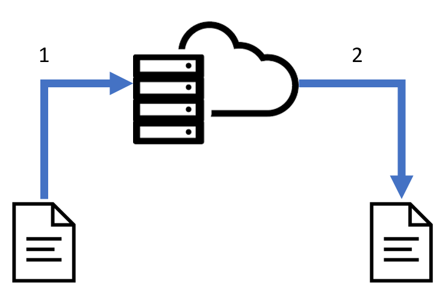

# Sharedb-ace
Sharedb-ace provides two-way bindings between [sharedb](https://github.com/share/sharedb) and [ace-editor](http://ace.c9.io/).

## Installation

https://www.npmjs.com/package/sharedb-ace

Option 1: Using npm:
```
npm install sharedb-ace
```

Option 2: Using pre-compiled js:

TODO: create distributable precompiled js file, put on CDN.

## Usage
Creating the `sharedb-ace` instance:
1. wsURL: the websocket URL used for bi-directional communication between shareDB and the browser.
2. namespace: namespace used in shareDB server.
3. itemID: id of your shareDB item.
```
var ShareAce = new SharedbAce(wsURL, namespace, itemID);
```

### Single Ace-editor Instance
Setup the ShareDB document as a string:
```htmlmixed
ShareAce.on('ready', function() {
  ShareAce.add(editor);
}); 
```

### Multiple Ace-editor Instances
Your setup may be more complex, and requires the use of multiple ace-instances synchronized over one connection. Setup the shareDB document to be a JSON object.

For example:

```javascript=
{
  "foo": "",
  "bar": ""
}
```

Next, connect the two ace-instances:

```htmlmixed=
ShareAce.on('ready', function() {
  ShareAce.add(editor1, ["foo"]);
  ShareAce.add(editor2, ["bar"]);
});
```

## How it works

[ShareDB](https://github.com/share/sharedb) is used as the layer for real-time synchronization of text. This is achieved through operational transformation. ShareDB provides adapters for several databases, including MongoDB and postgresql. 

Local changes are converted into shareDB ops, and are then sent to the server. These ops are transformed, and propogated to to client and then applied onto Ace text with deltas.

For example, inserting text where | is the cursor: 
```
abc|
```
```
abcd|
```

Produces the following delta and its corresponding op:

```
delta: {'start':{'row':1,'column':3},'end':{'row':1,'column':4},'action':'insert','lines':['d']}
op: [{"p":["code",3],"si":"d"}]
```
[Illustration of real-time synchronization]

Here is what happens when `Ace1` makes a local change:

1. `onLocalChange` listener on `Ace1` triggered.
2. `delta` transformed to shareDB op, and is sent to server
3. server accepts `op`, applies OT. 
4. 4. Transformed op is propogated to all other listening ace-instances: [`Ace2`]. TODO: this needs factual-checking. is it propogated to `Ace1` too? 
5. `Ace2` receives shareDB op from server, triggers `onRemoteChange`.
6. shareDB op transformed to ace delta, applied to editor.
7. Application of `delta` triggers `onLocalChange` on `Ace2`, but source is `self`, and the operation is suppressed. This prevents a feedback loop. 

## Developing sharedb-ace
1. Fork or clone this repo:

```
git clone https://github.com/jethrokuan/sharedb-ace.git
```

2. Install the dependencies (we use yarn):

```
cd sharedb-ace && yarn install
```

## TODO
- [ ] Write tests
- [ ] Allow for plugins
